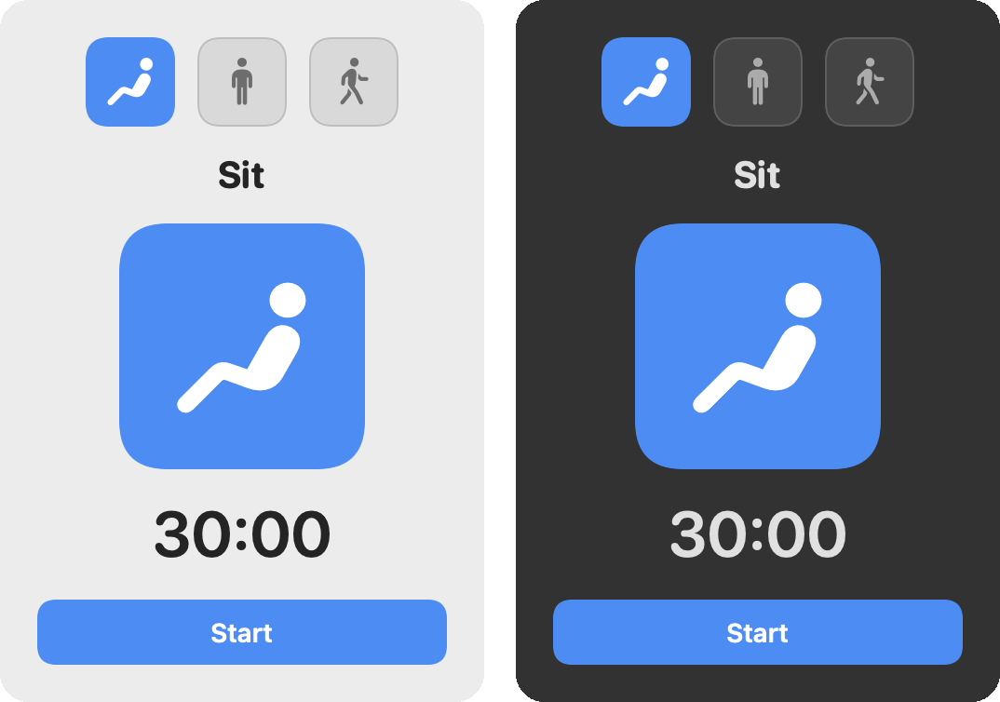
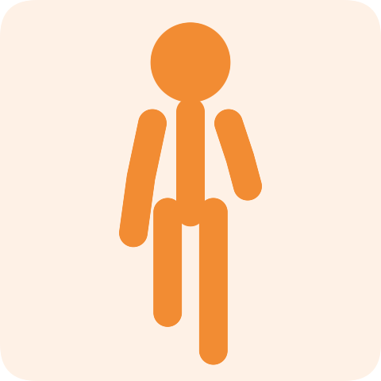

# SitStandMove

A tiny macOS menu bar app that walks you through **sit → stand → move** loops
throughout the day. It lives in your top bar, counts down the current phase, and
when time's up it pops open a little panel with an animated figure doing the next
action and a single button to start it.



| Sit | Stand | Move |
|:---:|:-----:|:----:|
|  |  |  |

The little actor breathes while sitting, sways while standing, and bobs along
while walking.

## How it works

1. Click the menu bar icon to open the panel. It shows the first phase (**Sit**),
   how long it will last, and a **Start** button. Tap any of the **Sit / Stand /
   Move** tiles at the top to choose which phase to begin with.
2. Press **Start**. The panel closes and the menu bar shows a live countdown.
3. When the phase ends, a chime plays and the panel pops back open showing the
   **next** action (e.g. *"Time to stand"*) with its little actor and duration.
4. Press **Start** to begin it. The loop keeps cycling: sit → stand → move → sit…

While a phase is running you can **Pause** or **Skip** from the panel.

### Settings

**Right-click** (or Control-click) the menu bar icon for the menu:

- **Settings…** — set how many minutes each of Sit, Stand, and Move lasts.
- **Reset Loop** — stop and return to the start of the loop.
- **Quit**.

Durations are the only setting, and they persist between launches.

## Build & run

Requires macOS 13+ and a Swift toolchain (Xcode or the Command Line Tools).

```sh
# Run it directly (great for development; Ctrl-C to quit):
make run

# Or build a proper menu-bar app bundle and launch it:
make open
```

`make open` produces `dist/SitStandMove.app`, which you can drag into
`/Applications` and add to your Login Items so it's always available.

## Project layout

```
Sources/SitStandMove/
  main.swift          # NSApplication entry point (menu-bar-only)
  AppDelegate.swift   # Status item, popover, right-click menu, settings window
  TimerManager.swift  # The sit/stand/move loop state machine + countdown
  SettingsStore.swift # Persisted per-phase durations
  Phase.swift         # The three phases (titles, icons, colors)
  PopoverView.swift   # The pop-out panel UI + tappable phase selectors
  FigureView.swift    # The animated actor (white SF Symbol on a color tile)
  SettingsView.swift  # Duration settings
scripts/bundle.sh     # Wraps the binary into a .app bundle
```
